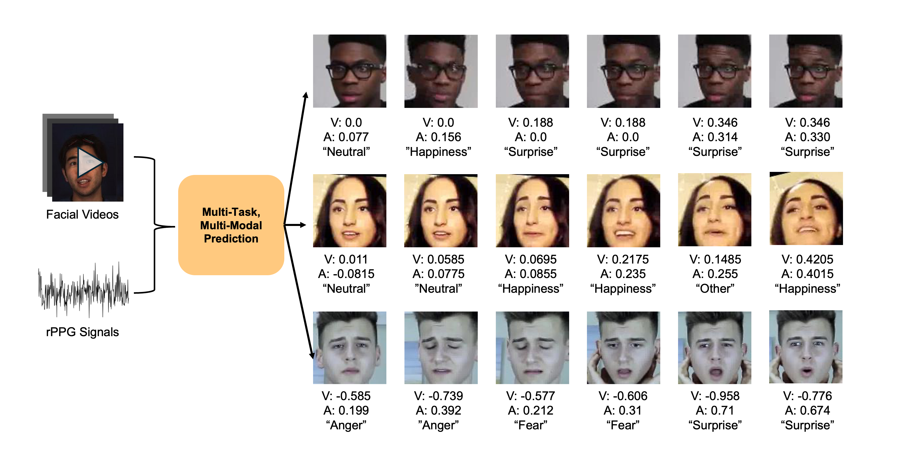

# AffectRec - L334 Mini Project
In this project, we develop a multi-task valence-arousal prediction model based on facial video frames and corresponding rPPG signals, trained in Aff-Wild2 dataset.

## Preprocessing
1. pip install -r requirements.txt.
2. Download Aff-Wild2 dataset.
3. Run `helper/preprocess_dataset.py` to generate annotation csv files for training/validation.
4. Run `helper/Contrast-PhysNet/extract.py` to extract rPPG signals for each video in dataset.

## Training
1. Run `helper/weight_calculation.py` to generate weights for each expression category in cross-entropy loss.
2. Run `train.py`, `train_rppg.py`, or `train_rppg_ccc.py` in `models/AffWild_Maxvit_Combined` to train the multi-task without rPPG modality, multi-task with rPPG, and multi-task with rPPG under cross-entropy and ccc loss.

## Evaluation
1. Move the trained `model.pt` into the `AffWild_Maxvit_Combined` folder.
2. Run `generate_csv.py` or `generate_csv_rppg.py` in `models/AffWild_Maxvit_Combined` to generate inference file.
3. Run `models/evaluation.py` to mesure the performance under classfication and regression metrics.

## Acknowledgement
Our code is based on `models/AffectNet8_Maxvit_Combined`, which is adapted from [CAGE: Circumplex Affect Guided Expression Inference](https://github.com/wagner-niklas/CAGE_expression_inference)
